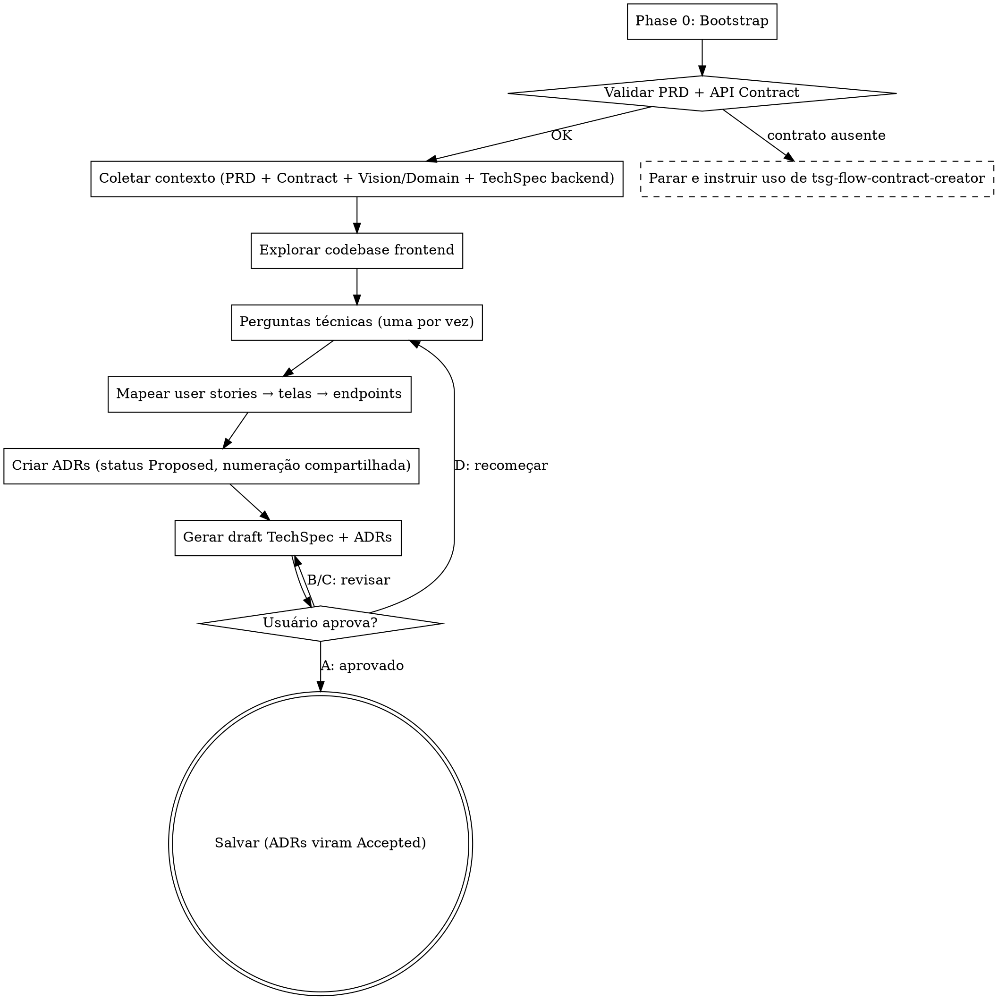

# Frontend TechSpec Creator

Traduz requisitos de PRD e contratos de API em decisões técnicas de frontend, incluindo arquitetura
de componentes, estratégia de fetching, gerenciamento de estado, tipagem e testes.

```
PRD (O QUÊ)
    ↓
tsg-flow-contract-creator → api-contract.yaml (FONTE DE VERDADE)
                                ↓
        ┌───────────────────────┴────────────────────────┐
        ↓                                                ↓
  tsg-flow-techspec-creator               tsg-flow-frontend-techspec-creator (VOCÊ ESTÁ AQUI)
        ↓                                                ↓
  techspec.md + adrs/                  frontend-techspec.md + adrs/ (compartilhada)
        ↓                                                ↓
        └───────────────────────┬────────────────────────┘
                                ↓
                          tsg-flow-task-creator
```

<HARD-GATE>
- NÃO operar sem `api-contract.yaml` — o contrato é pré-requisito ABSOLUTO
- NÃO escrever o arquivo TechSpec até TODAS as fases estarem completas E o usuário ter aprovado o draft final
- NÃO pular a exploração do codebase — toda TechSpec DEVE ser informada pela arquitetura existente
- NÃO pular interações com o usuário — o usuário DEVE participar das decisões técnicas
- NÃO exigir aprovação seção-por-seção — gere o draft completo e deixe o usuário revisar
- NÃO inferir stack — SEMPRE consulte SKILL.md disponíveis na Phase 0 antes de fazer decisões técnicas
- NÃO criar ADRs com status "Accepted" antes da aprovação do usuário — use "Proposed" durante o draft
- NÃO duplicar schemas do API Contract — referencie e gere tipos a partir dele
- NÃO contradizer o API Contract — se identificar problema no contrato, registre em "Questões em Aberto"
Isso se aplica a TODA TechSpec de frontend independentemente da complexidade percebida.
</HARD-GATE>

## Anti-Patterns Documentados

### Anti-Pattern 1: "Esta tela é simples demais para precisar de design review"

Toda TechSpec de frontend passa pelo processo completo. Uma tela CRUD básica, um modal, um wizard
de 3 passos — todos eles. Decisões "simples" sobre fetching, estado e tipagem são onde mais
acontecem inconsistências entre frontends do mesmo projeto. Você DEVE fazer perguntas técnicas e
obter aprovação antes de escrever o artefato.

### Anti-Pattern 2: "Escrever tipos manualmente em vez de gerar do contrato"

NUNCA proponha escrever tipos TypeScript/Flow/etc. manualmente quando o API Contract pode gerá-los.
A geração automática (openapi-typescript, orval, etc.) elimina divergência entre tipos do frontend
e contrato. Manualmente escrever tipos é dívida técnica garantida.

### Anti-Pattern 3: "Inferir stack sem consultar SKILL.md"

Não infira a stack de frontend a partir de pistas indiretas. Execute a Phase 0: liste as SKILL.md
disponíveis e use-as como fonte de verdade para decisões de framework, biblioteca de fetching,
padrão de estado e estrutura de pastas. Se nenhuma SKILL.md de frontend existir, registre a lacuna
explicitamente e proponha uma stack com justificativa para validação do usuário.

### Anti-Pattern 4: "Burocracia de fim de fluxo"

Após o usuário responder as perguntas técnicas e aprovar uma abordagem, não force segundo loop de
aprovação para Arquitetura de Componentes, Estratégia de Estado etc. Sintetize a direção aprovada
diretamente no documento.

## Como Fazer Perguntas

Quando esta skill instrui você a fazer uma pergunta ao usuário, você DEVE usar a ferramenta
interativa de pergunta do seu runtime — a ferramenta ou função que apresenta uma pergunta ao
usuário e **pausa a execução até o usuário responder**. Não emita perguntas como texto comum do
assistente e continue gerando.

## Entradas e Saídas

- **PRD requerido:** `tasks/prd-[nome-funcionalidade]/prd.md`
- **API Contract requerido:** `tasks/prd-[nome-funcionalidade]/api-contract.yaml`
- **Contexto opcional:**
  - `vision.md` (raiz do projeto) — restrições técnicas globais (stack obrigatória, design system)
  - `domains/[nome]/domain.md` — entidades, regras de negócio, eventos
  - Designs/wireframes referenciados no PRD (Figma, Stitch, v0)
- **Documento de saída:** `tasks/prd-[nome-funcionalidade]/frontend-techspec.md`
- **ADRs de saída:** `tasks/prd-[nome-funcionalidade]/adrs/adr-NNN.md` *(numeração compartilhada com backend)*

## Pré-requisitos

- Confirmar que o PRD existe em `tasks/prd-[nome-funcionalidade]/prd.md`
- **Confirmar que o API Contract existe** em `tasks/prd-[nome-funcionalidade]/api-contract.yaml`
- Se o contrato não existir: parar e instruir o usuário a executar primeiro `tsg-flow-contract-creator`
- Verificar se `vision.md` está disponível → extrair stack frontend, design system, restrições
- Verificar se `domains/[nome]/domain.md` está disponível → entender vocabulário de negócio
- Listar ADRs existentes em `tasks/prd-[nome-funcionalidade]/adrs/` para continuar a numeração
- Verificar se já existe `techspec.md` (backend) — pode informar decisões compartilhadas

## Checklist de Fases

1. **Phase 0: Bootstrap** — listar SKILL.md disponíveis (priorizar frontend)
2. **Validar pré-requisitos** — PRD + API Contract obrigatórios
3. **Coletar contexto** — ler PRD, API Contract, Vision/Domain Docs (se houver), TechSpec backend (se houver)
4. **Explorar codebase** — descobrir estrutura de frontend, componentes existentes, padrões
5. **Fazer perguntas técnicas** — focadas em frontend (3-6 perguntas)
6. **Criar ADRs** — decisões técnicas significativas (status "Proposed")
7. **Gerar draft da TechSpec** — usando o template canônico
8. **Revisar com o usuário** — loop A/B/C/D até aprovação
9. **Salvar arquivos** — TechSpec final + ADRs com status "Accepted"
10. **Reportar resultados** — caminhos, próximos passos, comando de mock e geração de tipos

## Workflow Detalhado

### Phase 0: Bootstrap (Obrigatório)

1. Liste todas as SKILL.md disponíveis (públicas, de usuário, de exemplo)
2. Identifique skills relevantes para frontend (ex: `react-architecture`, `nextjs-routing`,
   `vue-architecture`, `angular-state-management`, `tailwind-design-tokens`)
3. Identifique skills transversais (`design-patterns`, `accessibility`, `i18n`)
4. Registre quais skills informarão cada decisão
5. Se nenhuma SKILL.md de frontend existir, sinalize a lacuna ao usuário e prossiga propondo uma
   stack com justificativa

### 1. Validar Pré-requisitos

```
Existe tasks/prd-<nome>/prd.md?           → Se NÃO: parar, instruir criação do PRD
Existe tasks/prd-<nome>/api-contract.yaml? → Se NÃO: parar, instruir uso de tsg-flow-contract-creator
```

Não há "modo standalone" para frontend. O contrato é fonte de verdade obrigatória.

### 2. Coletar Contexto

**Sempre:**
- Ler PRD completo (com foco em user stories, fluxos de UI, telas mencionadas)
- Ler `api-contract.yaml` completo (endpoints, schemas, exemplos, `x-frontend-notes`)
- Ler `api-contract.md` se existir (versão legível)
- Listar ADRs existentes em `adrs/` para continuar numeração

**Se disponíveis:**
- Ler `vision.md` → stack obrigatória de frontend, design system, idioma, acessibilidade
- Ler `domains/<nome>/domain.md` → vocabulário de negócio (manter nomes nas labels e variáveis)
- Ler `techspec.md` (backend) → entender decisões já tomadas (paginação, autenticação, eventos)

Comunique ao usuário tudo que foi extraído antes de fazer perguntas.

### 3. Análise Profunda do Codebase de Frontend (Obrigatório)

- Estrutura de pastas existente (feature-based, atomic-design, layered)
- Componentes reutilizáveis disponíveis (botões, modais, forms, layouts)
- Sistema de fetching atual (React Query, SWR, RTK Query, Apollo, fetch puro)
- Padrão de estado (Zustand, Redux, Jotai, Context API, server-state-only)
- Sistema de roteamento e suas convenções
- Sistema de tipos (TypeScript config, tipos compartilhados)
- Sistema de estilização (Tailwind, CSS-in-JS, CSS Modules, design tokens)
- Padrões de testes (Vitest, Jest, RTL, Playwright, Cypress)
- Configuração de mocks e ambiente de dev

### 4. Esclarecimentos Técnicos (Obrigatório)

⚠️ **Uma pergunta por mensagem.** Múltipla escolha quando possível. Sempre incluir "D) Outro".

**Quantidade:** 3-6 perguntas, dependendo de quanto contexto vem dos artefatos upstream.

**Tópicos obrigatórios:**

- **Estrutura e roteamento:** onde a feature vive (qual rota, qual módulo, qual segmento)?
- **Estratégia de fetching:** lib a usar (se não decidido na Vision), padrão de cache, invalidação,
  retry, otimistic updates
- **Geração de tipos do contrato:** ferramenta (openapi-typescript, orval, kubb), local de saída,
  estratégia de regeneração
- **Estado:** server state vs client state — o que vai onde, qual lib para client state se houver
- **Componentização:** quais componentes reutilizar, quais criar, granularidade
- **Validação de formulários:** lib (react-hook-form, formik, zod, yup), estratégia de
  sincronização com schemas do contrato
- **Testes:** níveis (unit/integration/e2e), o que mockar (Prism do contrato vs MSW), cobertura
  esperada
- **Acessibilidade e i18n:** padrões obrigatórios, idiomas suportados (puxar da Vision Doc se houver)

**NÃO pergunte** (já está no contrato):
- ❌ Que endpoints chamar
- ❌ Que campos enviar/receber
- ❌ Códigos de erro possíveis
- ❌ Padrão de paginação
- ❌ Mecanismo de autenticação

### 5. Mapeamento de User Stories → Telas → Endpoints

Para cada user story do PRD, mapeie:

```
User Story → Tela(s)/Componente(s) → Endpoint(s) do contrato consumido(s)
```

Esta tabela é uma seção obrigatória do template e ajuda a garantir cobertura completa.

### 6. Mapeamento de Conformidade com Skills

- Mapeie cada decisão técnica para uma SKILL.md identificada na Phase 0
- Destaque desvios com justificativa
- Preencha a tabela "Skills de Referência" do template

### 7. Criar ADRs (Obrigatório)

Crie ao menos **1 ADR** documentando a decisão arquitetural primária do frontend (ex: escolha da
biblioteca de fetching, estratégia de geração de tipos). ADRs adicionais para decisões com
alternativas rejeitadas relevantes.

⚠️ **Numeração compartilhada com backend:** liste TODAS as ADRs existentes em `adrs/` (incluindo
as criadas pelo backend) e continue a numeração sequencialmente. Se o backend criou adr-001 a
adr-004, frontend começa em adr-005.

Para cada ADR:

1. Leia o template em `templates/adr-template.md` *(reutilizado da skill backend)*
2. Status inicial: **`Proposed`** (vira `Accepted` apenas após aprovação)
3. Date com a data atual
4. Guarde em memória — escrever junto com a TechSpec após aprovação

### 8. Gerar Draft da TechSpec (Obrigatório)

Use `templates/frontend-techspec-template.md` como estrutura exata. Diretrizes:

**Princípio editorial:** cada seção tem o tamanho mínimo necessário. Sem verbosidade.

**Aplicar YAGNI:**
- Remover componentes, abstrações e wrappers desnecessários
- Não criar pasta nova quando um arquivo em pasta existente resolve
- Não criar HOC/wrapper quando hook composto resolve

**Mapeamentos obrigatórios:**
- Toda user story mapeia para tela/componente
- Todo endpoint do contrato consumido mapeia para um hook/service específico
- Toda RN-XX do Domain Doc *(se existir)* mapeia para validação no formulário ou no fluxo

**Tratamento do contrato:**
- Schemas → tipos gerados automaticamente (nunca manualmente)
- Endpoints → hooks de fetching tipados
- Erros do contrato → tratamento centralizado mapeando `code` para mensagens de UI
- Mocks → Prism para dev, MSW para testes (ou conforme decidido)

**Inventário de Artefatos exaustivo** com 4 colunas:

```
| Caminho | Tipo | Skills Aplicáveis | Descrição |
```

Tipos típicos de frontend:
- Page/Route
- Component (atomic / molecule / organism / template / page conforme padrão)
- Hook
- Service / API client
- Store / State slice
- Type (gerado vs manual)
- Mock (MSW handler)
- Test (unit / integration / e2e)
- Style / Theme tokens
- Storybook story

Inclua:
- Configuração de geração de tipos (ex: `openapi-typescript.config.ts`)
- Configuração de mocks (Prism, MSW)
- Atualização de roteamento principal
- Variáveis de ambiente novas

**Build Order:**

```
1. Configurar geração de tipos a partir do contrato — sem dependências
2. Tipos gerados — depende de 1
3. Service/hook de fetching base — depende de 2
4. Componentes apresentacionais — sem dependências (pode paralelizar)
5. Página integrando hooks + componentes — depende de 3 e 4
6. Testes — depende de todos
```

**Architecture Decision Records (Seção Final Obrigatória):**

Listar TODAS as ADRs (incluindo backend) com link e resumo. Marcar quais foram criadas nesta
sessão de frontend.

**Tom e Linguagem:**
- Português (PT-BR)
- Voz ativa, palavras precisas
- Cada frase justifica sua presença

### 9. Revisar com o Usuário (Obrigatório)

Apresente o draft completo da TechSpec e os drafts das ADRs. Use a ferramenta interativa:

```
Aqui está o draft da TechSpec de Frontend e das ADRs criadas. Por favor revise e indique:
A) Aprovado — salvar como está e mudar status das ADRs para "Accepted"
B) Ajustar seções específicas (me diga quais)
C) Reescrever seção X (me diga o que mudar)
D) Descartar e recomeçar do zero
```

- **B ou C:** aplicar mudanças e apresentar novamente
- **D:** voltar à fase 4 (perguntas)
- **A:** prosseguir para fase 10

### 10. Salvar Arquivos

Após aprovação:

1. Atualizar status de TODAS as novas ADRs para `Accepted`
2. Escrever cada ADR em `tasks/prd-<nome>/adrs/adr-NNN.md`
3. Escrever a TechSpec em `tasks/prd-<nome>/frontend-techspec.md`
4. Confirmar todos os caminhos ao usuário

### 11. Reportar Resultados

Mensagem final deve conter:

1. **Resumo de decisões técnicas de frontend**
2. **Stack escolhida** (framework, fetching, estado, validação, testes)
3. **Lista de ADRs criadas nesta sessão** (números, títulos, resumos) — diferenciar das herdadas
4. **Caminhos dos arquivos salvos**
5. **Resumo do Inventário de Artefatos**
6. **Comandos prontos para uso:**
   ```bash
   # Gerar tipos a partir do contrato
   npx openapi-typescript tasks/prd-<nome>/api-contract.yaml -o src/types/api.ts

   # Subir mock server durante dev
   npx @stoplight/prism-cli mock tasks/prd-<nome>/api-contract.yaml
   ```
7. **Questões em aberto**
8. **Próximo passo:** "Para gerar as tarefas de implementação do frontend, use a skill
   `tsg-flow-task-creator` referenciando este `frontend-techspec.md`."

## Process Flow



## Tratamento de Erros

- **PRD ausente:** parar e instruir o usuário a executar primeiro o skill de criação de PRD
- **API Contract ausente:** parar e instruir uso de `tsg-flow-contract-creator`. Não oferecer fallback —
  TechSpec de frontend sem contrato é dívida técnica imediata
- **Conflito identificado entre PRD e Contract:** registrar em "Questões em Aberto" e pausar para
  validação humana — o contrato é fonte de verdade para implementação, mas o PRD é fonte para o
  produto. Conflitos podem indicar que o contrato precisa ser ajustado
- **Stack não definida na Vision Doc:** propor stack com justificativa, criar ADR específica para
  a decisão, validar com o usuário antes de prosseguir
- **Mudanças necessárias no contrato:** NÃO contradizer o contrato na TechSpec. Listar em
  "Questões em Aberto" e instruir o usuário a executar `tsg-flow-contract-creator` em modo update se
  as mudanças forem aprovadas
- **Diretório `adrs/` não existe:** criar
- **Modo update (frontend-techspec.md já existe):** ler e preservar seções não alteradas; perguntar
  quais seções atualizar

## Princípios Fundamentais

- **API Contract é soberano** — frontend nunca contradiz o contrato; tipos derivam dele
- **Tipos gerados, nunca manuais** — divergência entre tipos e contrato é dívida técnica garantida
- **Mocks do contrato durante dev** — Prism elimina dependência do backend para começar
- **Server state ≠ client state** — usar libs apropriadas para cada (React Query/SWR para server)
- **Componentes apresentacionais sem fetching** — separar lógica de apresentação
- **Erros são first-class** — mapear `code` do contrato para mensagens de UI no início
- **YAGNI ruthlessly** — sem wrappers, HOCs, abstrações ou pastas desnecessárias
- **Phase 0 obrigatória** — SKILL.md disponíveis são fonte de verdade da stack
- **ADRs compartilhadas** — numeração contínua entre backend e frontend
- **Idioma:** Português (PT-BR), tom técnico claro

## Checklist de Qualidade Final

- [ ] Phase 0 executada — SKILL.md de frontend listadas
- [ ] PRD lido na íntegra
- [ ] **API Contract lido** — endpoints, schemas, exemplos, `x-frontend-notes`
- [ ] Vision Doc / Domain Doc / TechSpec backend extraídos *(se existirem)*
- [ ] Codebase de frontend explorado
- [ ] Perguntas técnicas respondidas (3-6 perguntas)
- [ ] Mapeamento User Story → Tela → Endpoint completo
- [ ] ADRs criadas com status "Proposed" e numeração compartilhada com backend
- [ ] Draft da TechSpec gerado seguindo o template
- [ ] Tabela de Skills de Referência preenchida
- [ ] Estratégia de geração de tipos definida (ferramenta + caminho de saída)
- [ ] Estratégia de mocks definida (Prism / MSW / outro)
- [ ] Inventário de Artefatos completo com 4 colunas
- [ ] Build Order com dependências explícitas
- [ ] Seção Architecture Decision Records linkando todas as ADRs (backend + frontend)
- [ ] Usuário aprovou o draft (resposta A)
- [ ] ADRs com status atualizado para "Accepted"
- [ ] Arquivos salvos em `tasks/prd-<nome>/frontend-techspec.md` e `tasks/prd-<nome>/adrs/`
- [ ] Comandos de geração de tipos e mock entregues ao usuário
