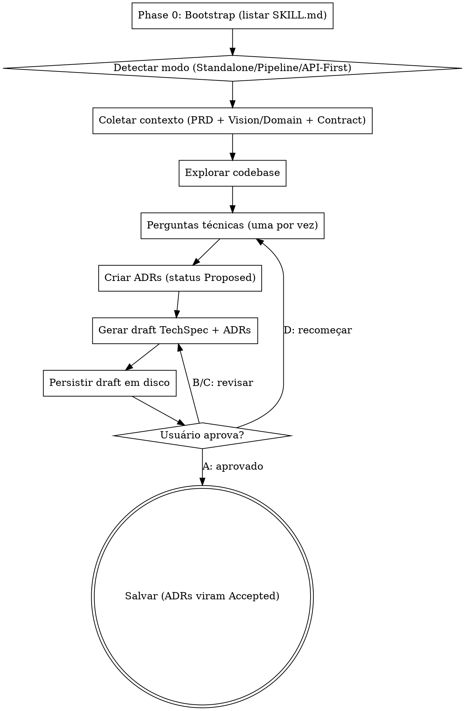

# TechSpec Creator

Traduz requisitos de um PRD em orientações técnicas, decisões arquiteturais e um inventário completo
de artefatos. O documento gerado serve como entrada para a skill `tsg-flow-task-creator`.

```
PRD (O QUÊ)
    ↓
[se for API] tsg-flow-contract-creator → api-contract.yaml
    ↓                                        ↓
    └────────────────────────────────────────┴──→ tsg-flow-techspec-creator (VOCÊ ESTÁ AQUI)
                                                            ↓
                                                       techspec.md + adrs/
                                                            ↓
                                                       tsg-flow-task-creator
```

<HARD-GATE>
- NÃO tratar um rascunho como TechSpec aprovada nem entregá-lo ao `tsg-flow-task-creator`
- Após as fases de discovery, decisões e revisão de qualidade, PERSISTIR o draft completo em disco
  para que o usuário possa revisá-lo como arquivo; a promoção para os artefatos canônicos só ocorre
  após a aprovação explícita
- NÃO pular a exploração do codebase — toda TechSpec DEVE ser informada pela arquitetura existente
- NÃO pular interações com o usuário — o usuário DEVE participar das decisões técnicas
- NÃO exigir aprovação seção-por-seção — gere o draft completo e deixe o usuário revisar
- NÃO inferir stack — SEMPRE consulte SKILL.md disponíveis na Phase 0 antes de fazer decisões técnicas
- NÃO criar ADRs com status "Accepted" antes da aprovação do usuário — use "Proposed" durante o draft
- NÃO duplicar conteúdo do API Contract quando ele existir — referencie, não copie
Isso se aplica a TODA TechSpec independentemente da complexidade percebida.
</HARD-GATE>

## Anti-Patterns Documentados

### Anti-Pattern 1: "Esta feature é simples demais para precisar de design review"

Toda TechSpec passa pelo processo completo. Um único endpoint, um refactor menor, uma mudança de
configuração — todos eles. Mudanças "simples" são onde suposições não examinadas sobre a arquitetura
existente causam o maior número de falhas de integração. O design review pode ser breve para mudanças
genuinamente simples, mas você DEVE fazer perguntas técnicas e obter aprovação na abordagem antes de
promover o artefato. O draft em disco serve justamente para tornar essa revisão verificável.

### Anti-Pattern 2: "Burocracia de fim de fluxo"

Após o usuário responder as perguntas técnicas e aprovar uma abordagem, não force-o a um segundo
loop de aprovação para Arquitetura do Sistema, Modelos de Dados, Design de API ou outras seções
finais. Sintetize a direção aprovada diretamente no documento. O usuário pode revisar e pedir
edições no arquivo gerado depois.

### Anti-Pattern 3: "Inferir stack sem consultar SKILL.md"

Nunca infira a stack do projeto a partir de pistas indiretas (extensões de arquivo, nomes de pasta).
Sempre execute a Phase 0 bootstrap: liste as SKILL.md disponíveis e use-as como fonte de verdade
para decisões de tooling, padrões de código e estrutura de pastas. Se nenhuma SKILL.md de stack
existir, registre essa lacuna explicitamente na TechSpec.

## Como Fazer Perguntas

Quando esta skill instrui você a fazer uma pergunta ao usuário, você DEVE usar a ferramenta
interativa de pergunta do seu runtime — a ferramenta ou função que apresenta uma pergunta ao
usuário e **pausa a execução até o usuário responder**. Não emita perguntas como texto comum do
assistente e continue gerando; sempre use o mecanismo que bloqueia até o usuário responder.

Se seu runtime não fornecer essa ferramenta, apresente a pergunta como sua mensagem completa e pare
de gerar. Não responda sua própria pergunta nem prossiga sem input do usuário.

## Modos de Operação

A skill detecta automaticamente o modo de operação com base nos artefatos disponíveis no diretório
`tasks/prd-[nome-funcionalidade]/`:

```
1. Existe api-contract.yaml?
   ├─ SIM  → Modo API-First (contrato é fonte de verdade dos endpoints)
   └─ NÃO  → Existe vision.md OU domains/[nome]/domain.md?
              ├─ SIM  → Modo Pipeline (extrai contexto de upstream)
              └─ NÃO  → Modo Standalone (discovery técnico completo)
```

### Modo Standalone

- Apenas o PRD está disponível
- Discovery técnico completo: 4-7 perguntas cobrindo arquitetura, dados, API, testes, observabilidade, performance
- Você decide os endpoints com base nas user stories do PRD
- Mais perguntas, mais ADRs, maior responsabilidade de design

### Modo Pipeline

- PRD + Vision Doc e/ou Domain Doc disponíveis
- Extraia primeiro tudo que já está documentado
- Faça apenas 2-4 perguntas focadas nas lacunas
- Entidades do Domain Doc viram modelos de dados (mantenha os nomes)
- Regras de negócio (RN-XX) viram validações e casos de teste
- Eventos do domínio informam contratos assíncronos

### Modo API-First

- PRD + `api-contract.yaml` disponíveis (Vision/Domain podem ou não existir)
- O contrato é a fonte de verdade — endpoints, schemas e formato de erros já estão decididos
- A TechSpec foca em **como implementar** o contrato:
  - Mapeamento controller → use case → domain
  - DTOs internos (camada de aplicação) vs schemas do contrato (camada de API)
  - Estratégia de persistência por trás dos schemas
  - Validações além das declaradas no contrato
  - Mapeamento de erros de domínio para `ErrorResponse` do contrato
- A seção "Endpoints de API" da TechSpec é uma **referência** ao contrato — não duplica endpoints/schemas
- 2-4 perguntas focadas em implementação interna

⚠️ Nunca contradiga o API Contract. Se identificar que o contrato precisa mudar, registre na seção
"Questões em Aberto" e pause para validação com o usuário.

## Entradas e Saídas

- **PRD requerido:** `tasks/prd-[nome-funcionalidade]/prd.md`
- **Contexto opcional (enriquece a TechSpec):**
  - `vision.md` (raiz do projeto) — restrições técnicas globais
  - `domains/[nome]/domain.md` — entidades, regras de negócio, eventos
  - `tasks/prd-[nome-funcionalidade]/api-contract.yaml` — contrato OpenAPI
- **Documento de saída:** `tasks/prd-[nome-funcionalidade]/techspec.md`
- **ADRs de saída:** `tasks/prd-[nome-funcionalidade]/adrs/adr-NNN.md`

## Pré-requisitos

- Confirmar que o PRD existe em `tasks/prd-[nome-funcionalidade]/prd.md`
- Verificar se `vision.md` está disponível → extrair restrições técnicas globais
- Verificar se `domains/[nome]/domain.md` está disponível → extrair entidades, regras e eventos
- Verificar se `api-contract.yaml` está disponível → tratar como fonte de verdade dos endpoints
- Listar ADRs existentes em `tasks/prd-[nome-funcionalidade]/adrs/` para continuar a numeração

## Checklist de Fases

Você DEVE executar as fases na ordem abaixo:

1. **Phase 0: Bootstrap** — listar SKILL.md disponíveis no projeto
2. **Detectar modo** — verificar artefatos disponíveis e definir Standalone/Pipeline/API-First
3. **Coletar contexto** — ler PRD, Vision/Domain Docs (se houver), API Contract (se houver), ADRs existentes
4. **Explorar codebase** — descobrir padrões, módulos, componentes existentes
5. **Fazer perguntas técnicas** — uma por vez, focadas nas lacunas do modo detectado
6. **Criar ADRs** — registrar decisões técnicas significativas (status "Proposed")
7. **Gerar draft da TechSpec** — usando o template canônico
8. **Persistir o draft** — TechSpec e ADRs em arquivos de revisão, nunca apenas no chat
9. **Revisar com o usuário** — loop A/B/C/D até aprovação
10. **Promover os arquivos** — TechSpec final + ADRs com status "Accepted"
11. **Reportar resultados** — caminhos, próximos passos, questões em aberto

## Workflow Detalhado

### Phase 0: Bootstrap (Obrigatório)

Antes de qualquer decisão técnica:

1. Liste todas as SKILL.md disponíveis (públicas, de usuário, de exemplo)
2. Identifique skills relevantes para a stack do projeto (ex: `java-architecture`, `nextjs-routing`)
3. Identifique skills transversais (`design-patterns`, `restful-api`, etc.)
4. Registre no rascunho mental quais skills informarão cada decisão
5. Se nenhuma SKILL.md de stack existir, sinalize a lacuna e prossiga com decisões explicitamente
   marcadas como "sem skill de referência — validar com o usuário"

### 1. Detectar Modo de Operação

Verifique os artefatos:

```
Existe tasks/prd-<nome>/api-contract.yaml?
  SIM  → MODO API-FIRST
  NÃO  → Existe vision.md ou domains/<nome>/domain.md?
           SIM  → MODO PIPELINE
           NÃO  → MODO STANDALONE
```

Comunique ao usuário qual modo foi detectado e por quê, antes de prosseguir.

### 2. Coletar Contexto

**Sempre:**
- Ler PRD completo
- Listar ADRs existentes em `adrs/` (se houver) para continuar numeração

**Modo Pipeline ou API-First (se aplicável):**
- Ler `vision.md` → extrair restrições técnicas globais, regulatórias, fase do roadmap
- Ler `domains/<nome>/domain.md` → extrair entidades, RN-XX, eventos, dependências upstream/downstream

**Modo API-First (sempre):**
- Ler `api-contract.yaml` completo
- Mapear endpoints do contrato → componentes de implementação necessários
- Mapear schemas do contrato → DTOs de API
- Identificar `x-backend-notes` (hints de implementação)

Liste explicitamente ao usuário o que foi extraído de cada documento de contexto, para que ele
saiba o que NÃO precisa repetir nas perguntas.

### 3. Análise Profunda do Codebase (Obrigatório)

- Descobrir arquivos, módulos, interfaces e pontos de integração implicados
- Mapear símbolos, dependências e pontos críticos
- Explorar estratégias de solução, padrões existentes, riscos e alternativas
- Análise ampla: chamadores/chamados, configs, middleware, persistência, concorrência,
  tratamento de erros, testes, infra
- **[Modo Pipeline]** Mapear entidades do Domain Doc para modelos de dados candidatos
- **[Modo Pipeline]** Mapear regras de negócio (RN-XX) para validações e casos de teste candidatos
- **[Modo API-First]** Mapear cada endpoint do contrato para um caminho controller→use case→domain

### 4. Esclarecimentos Técnicos (Obrigatório)

⚠️ Faça **uma pergunta por mensagem**. Prefira múltipla escolha quando as opções forem
predetermináveis. Inclua sempre fallback "D) Outro — descrever" para flexibilidade.

**Quantidade por modo:**
- Standalone: 4-7 perguntas
- Pipeline: 2-4 perguntas (focadas em lacunas)
- API-First: 2-4 perguntas (focadas em implementação interna)

**Tópicos obrigatórios (cobrir conforme modo):**

| Tópico | Standalone | Pipeline | API-First |
|--------|:---------:|:--------:|:---------:|
| Arquitetura e limites de componentes | ✅ | ✅ | ✅ |
| Modelos de dados e persistência | ✅ | conforme lacuna | ✅ (interna) |
| Design de API e endpoints | ✅ | ✅ | ❌ (já no contrato) |
| Estratégia de testes (unit/integration/e2e) | ✅ | ✅ | ✅ |
| Observabilidade (logging, métricas, tracing) | ✅ | conforme lacuna | conforme lacuna |
| Performance (caching, batch, N+1) | ✅ | conforme lacuna | conforme lacuna |

**No modo API-First, NÃO pergunte:**
- ❌ Que endpoints expor (já no contrato)
- ❌ Padrão de paginação (já no contrato)
- ❌ Formato de erro (já no contrato)
- ❌ Autenticação (já no contrato)

**No modo API-First, PERGUNTE:**
- ✅ Mapeamento controller → use case → domain (qual padrão arquitetural)
- ✅ DTOs internos vs schemas do contrato (camada de aplicação)
- ✅ Estratégia de persistência por trás dos schemas
- ✅ Validações além das do contrato (regras de negócio)
- ✅ Mapeamento de exceções de domínio para `ErrorResponse`

### 5. Mapeamento de Conformidade com Skills (Obrigatório)

- Mapeie cada decisão técnica para uma SKILL.md identificada na Phase 0
- Destaque desvios de convenções estabelecidas com justificativa
- Preencha a tabela "Skills de Referência" do template

### 6. Criar ADRs (Obrigatório)

Crie ao menos **1 ADR** documentando a decisão arquitetural primária. ADRs adicionais para
decisões com alternativas rejeitadas relevantes ou impacto cross-cutting.

Para cada ADR:

1. Leia o template em `templates/adr-template.md`
2. Determine o próximo número listando arquivos em `tasks/prd-<nome>/adrs/`
3. Numere com 3 dígitos zero-padded (`adr-001.md`, `adr-002.md`, etc.)
4. Status inicial: **`Proposed`** (vira `Accepted` apenas após aprovação do usuário)
5. Preencha: contexto, decisão, alternativas consideradas (com prós/contras/motivo da rejeição),
   consequências (positivas, negativas, riscos)
6. Date com a data atual
7. Não publique a ADR como aceita. O contrato de persistência e os nomes dos arquivos de draft estão
   em [references/delivery-contract.md](references/delivery-contract.md).

### 7. Gerar Draft da TechSpec (Obrigatório)

Use `templates/techspec-template.md` como estrutura exata. Diretrizes:

Antes de renderizar, leia [references/delivery-contract.md](references/delivery-contract.md). O
draft deve conter o mapa de fatias verticais e seus checkpoints de feedback; não basta produzir uma
análise em texto na conversa.

**Princípio editorial:** Cada seção deve ter o tamanho mínimo necessário para informar a
implementação. Evite verbosidade decorativa.

**Aplicar YAGNI ruthlessly:**
- Remover qualquer componente, interface ou abstração que não seja estritamente necessário
- NÃO propor novos pacotes ou diretórios quando a feature pode ser implementada adicionando um
  único arquivo a um pacote existente

**Mapeamentos obrigatórios:**
- Toda meta/user story do PRD mapeia para um componente técnico
- **[Modo Pipeline]** Toda RN-XX mapeia para uma validação ou caso de teste
- **[Modo Pipeline]** Toda entidade do Domain Doc mantém o nome de negócio nos modelos de dados
- **[Modo API-First]** Cada endpoint do contrato tem caminho de implementação claro

**Tratamento de endpoints:**
- **Standalone/Pipeline:** definir endpoints completos na TechSpec (método, path, request/response)
- **API-First:** seção "Endpoints de API" contém apenas referência ao `api-contract.yaml`. Listar
  os `operationId` e o caminho de implementação (controller → use case), sem duplicar schemas

**Inventário de Artefatos exaustivo:**

Liste TODOS os arquivos com 5 colunas, vinculando cada artefato a uma fatia ou habilitador:

```markdown
| Caminho | Fatia | Tipo | Skills Aplicáveis | Descrição |
```

Cada arquivo deve ter:
- Caminho completo (relativo à raiz do projeto)
- Fatia vertical (`V-XX`) ou habilitador inevitável (`EN-XX`)
- Tipo (Controller, Use Case, Domain Entity, Repository, DTO, Mapper, Migration, Test, Config, etc.)
- Skills aplicáveis (lista das SKILL.md identificadas na Phase 0 que se aplicam ao arquivo)
- Descrição breve (1 linha)

Inclua:
- Arquivos de teste para cada componente principal
- Migrations de banco
- Arquivos de configuração e variáveis de ambiente
- Documentação (atualização de README, JavaDoc/JSDoc, OpenAPI annotations)

**Sequenciamento de Desenvolvimento:**

Build Order numerada com dependências explícitas:

```
1. [Componente A] — sem dependências
2. [Componente B] — depende de 1
3. [Componente C] — depende de 1 e 2
```

Ordene preferencialmente **fatias verticais**, não camadas. Cada passo deve terminar em um
comportamento demonstrável e uma evidência de validação; componentes compartilhados só entram
isoladamente quando forem um habilitador técnico inevitável.

**Architecture Decision Records (Seção Final Obrigatória):**

Listar todas as ADRs criadas (incluindo herdadas do PRD), com link e resumo de uma linha:

```markdown
- [ADR-001: Título](adrs/adr-001.md) — resumo da decisão
- [ADR-002: Título](adrs/adr-002.md) — resumo da decisão
```

**Tom e Linguagem:**
- Português (PT-BR)
- Voz ativa, palavras precisas, sem generalidades vagas
- Cada frase deve justificar sua presença

### 9. Revisar com o Usuário (Obrigatório)

Depois de persistir os arquivos de draft, releia-os e apresente ao usuário os caminhos e um resumo
do conteúdo. O arquivo é a fonte de revisão; não substitua a escrita por uma resposta longa no chat.
Use a ferramenta interativa:

```
Aqui está o draft da TechSpec e das ADRs criadas. Por favor revise e indique:
A) Aprovado — salvar como está e mudar status das ADRs para "Accepted"
B) Ajustar seções específicas (me diga quais)
C) Reescrever seção X (me diga o que mudar)
D) Descartar e recomeçar do zero
```

- **B ou C:** aplicar mudanças e apresentar novamente
- **D:** voltar à fase 4 (perguntas)
- **A:** prosseguir para fase 10

### 10. Promover e Salvar Arquivos (Obrigatório)

Após aprovação:

1. Atualizar o status da TechSpec para `Aprovado`
2. Atualizar status de TODAS as novas ADRs para `Accepted`
3. Promover o draft para `tasks/prd-<nome>/techspec.md`
4. Promover cada ADR para `tasks/prd-<nome>/adrs/adr-NNN.md`
5. Confirmar todos os caminhos de escrita ao usuário

### 11. Reportar Resultados

Mensagem final deve conter:

1. **Resumo de decisões e modo de operação detectado**
2. **[Modo Pipeline]** O que foi herdado do Vision/Domain Doc vs. decidido nesta sessão
3. **[Modo API-First]** Mapeamento dos endpoints do contrato para componentes de implementação
4. **Lista de ADRs criadas** (números, títulos, resumos)
5. **Caminhos dos arquivos salvos** (drafts durante revisão; TechSpec + ADRs canônicos após A)
6. **Resumo do Inventário de Artefatos** (quantidade de arquivos a criar/modificar/referenciar)
7. **Questões em aberto** e follow-ups para stakeholders
8. **Próximo passo:** "Para gerar as tarefas de implementação, use a skill `tsg-flow-task-creator`. Para
   gerar a TechSpec do frontend (se aplicável), use `tsg-flow-frontend-techspec-creator`."

## Process Flow



## Tratamento de Erros

- **PRD ausente:** parar e instruir o usuário a executar primeiro o skill de criação de PRD
- **Codebase com padrões arquiteturais conflitantes:** documentar ambos e recomendar um com justificativa
- **Usuário rejeita design (D):** voltar à fase 4 incorporando todo o feedback
- **Diretório alvo não existe:** criar `tasks/prd-<nome>/` e `tasks/prd-<nome>/adrs/`
- **Modo update (techspec.md já existe):** ler e preservar seções não alteradas; perguntar quais
  seções o usuário quer atualizar
- **API Contract ausente em feature claramente API:** sugerir ao usuário executar
  `tsg-flow-contract-creator` antes de prosseguir; oferecer opção de continuar em modo Standalone com
  endpoints definidos na própria TechSpec (e premissa registrada)
- **Conflito entre TechSpec e API Contract:** parar e registrar na seção "Questões em Aberto" para
  validação humana — o contrato é fonte de verdade

## Princípios Fundamentais

- **A TechSpec foca em COMO, não O QUÊ** (PRD possui o que/por quê)
- **Detecção automática de modo** — adapta-se ao contexto disponível sem perguntar redundantemente
- **YAGNI ruthlessly** — Remover componentes, abstrações e interfaces desnecessários
- **Draft completo, então revisar** — não fragmentar aprovação por seção
- **Foco técnico apenas** — Nunca perguntar coisas de produto/negócio (isso é PRD)
- **Trade-offs são obrigatórios** — Resumo Executivo deve declarar o trade-off primário
- **PRD como input** — toda meta do PRD mapeia para componente técnico
- **Pipeline awareness** — TechSpec alimenta `tsg-flow-task-creator`; foque em HOW, não WHAT/WHY
- **Template compliance** — Toda TechSpec segue o template canônico
- **Phase 0 obrigatória** — SKILL.md disponíveis são fonte de verdade da stack
- **Contrato é soberano** — em modo API-First, nunca contradizer o `api-contract.yaml`
- **Idioma:** Português (PT-BR), tom técnico claro e consistente

## Checklist de Qualidade Final

- [ ] Phase 0 executada — SKILL.md disponíveis listadas
- [ ] Modo de operação detectado e comunicado ao usuário
- [ ] PRD lido na íntegra
- [ ] **[Modo Pipeline]** Vision Doc / Domain Doc extraídos
- [ ] **[Modo API-First]** API Contract lido e endpoints mapeados
- [ ] Codebase explorado
- [ ] Perguntas técnicas respondidas (quantidade adequada ao modo)
- [ ] ADRs criadas com status "Proposed"
- [ ] Draft da TechSpec gerado seguindo o template
- [ ] Tabela de Skills de Referência preenchida
- [ ] **[Modo Pipeline]** Entidades do Domain Doc mapeadas para modelos de dados
- [ ] **[Modo Pipeline]** Regras de negócio (RN-XX) mapeadas para validações e testes
- [ ] **[Modo API-First]** Endpoints da TechSpec apenas referenciam o contrato (sem duplicação)
- [ ] Inventário de Artefatos completo (caminho + tipo + skills + descrição)
- [ ] Mapa de fatias verticais completo, com comportamento observável e checkpoint por fatia
- [ ] Tarefas habilitadoras horizontais justificadas e mantidas no menor escopo possível
- [ ] Build Order com dependências explícitas
- [ ] Seção Architecture Decision Records linkando todas as ADRs
- [ ] Draft completo persistido em `techspec.draft.md` e ADRs `.draft.md`
- [ ] Usuário aprovou o draft (resposta A)
- [ ] ADRs com status atualizado para "Accepted"
- [ ] Arquivos salvos em `tasks/prd-<nome>/techspec.md` e `tasks/prd-<nome>/adrs/adr-NNN.md`
- [ ] Próximos passos comunicados ao usuário
