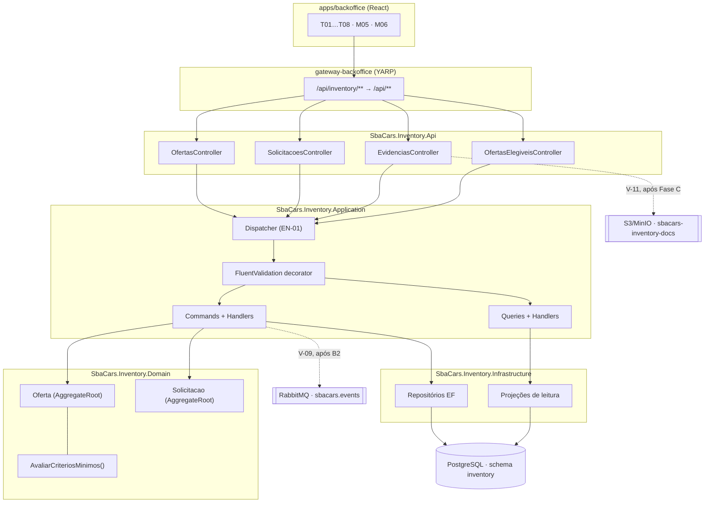

# Especificação Técnica — Gestão do Estoque Curado e Disponibilidade

> **Modo de operação:** API-First
> **PRD de origem:** `tasks/prd-gestao-do-estoque-curado-e-disponibilidade/prd.md`
> **API Contract:** `tasks/prd-gestao-do-estoque-curado-e-disponibilidade/api-contract.yaml`
> **UX Spec:** `tasks/prd-gestao-do-estoque-curado-e-disponibilidade/ux-spec.md`
> **Domain Doc:** `domains/estoque-curado/domain.md`
> **Plano de fundação:** `docs/architecture/backend-foundation.md`
> **Data:** 2026-08-16
> **Status:** Em Revisão
> **Handoff:** draft — não gerar Tasks

---

## Resumo Executivo

O D02 é implementado em `inventory-service` como **dois agregados** — `Oferta` (raiz, contendo
Veículo, Fatos, Preço e Disponibilidade) e `Solicitacao` (raiz, referenciando Oferta por id) —
sobre **CQRS nativo sem MediatR**, com dispatcher próprio e handlers resolvidos por tipo via DI.
O conhecimento dos seis critérios mínimos de elegibilidade vive em um único método de domínio,
`Oferta.AvaliarCriteriosMinimos()`, consumido pelo checklist do `GET`, pela validação da
solicitação de elegibilidade e pelo protocolo de confirmação de suspensão do RF-03.

Este é o **primeiro domínio real do repositório** — os quatro serviços têm hoje apenas
`ProbeController`, `DbContext` vazio e `InitialCreate`. As decisões aqui viram o precedente dos
outros três.

**Trade-off primário:** escolhemos **corretude transacional sobre velocidade de entrega**. Duas
consequências concretas. Primeira: as fatias que publicam eventos de integração ficam bloqueadas
pela Fase B2 (outbox), em vez de publicar direto e aceitar que um evento perdido tire uma oferta
aprovada do catálogo em silêncio (ADR-004). Segunda: a suspensão de elegibilidade custa dois
round-trips no caminho em que ocorre, em vez de suspender calado e avisar depois (ADR-003). O que
se ganha é que nenhuma oferta fica elegível com critério quebrado, e nenhuma sai do catálogo sem
alguém ter confirmado. O que se abre mão é entregar o RF-05 e o RF-06 ponta a ponta antes de uma
dependência de fundação que não é nossa.

O fatiamento foi montado para que esse bloqueio doa o mínimo: **as sete primeiras fatias entregam
comportamento demonstrável sem publicar nenhum evento**, incluindo a fila de validação inteira e a
transição de uma oferta para elegível.

---

## Skills de Referência

| Skill | Caminho | Decisões Influenciadas |
|---|---|---|
| `dotnet-architecture` | `.claude/skills/dotnet-architecture/SKILL.md` | Clean Architecture, escolha CQRS vs Service Pattern (ADR-001), repositório atrás de interface, `IExceptionHandler` + `ProblemDetails`, FluentValidation antes de efeito colateral, `CancellationToken` em toda a cadeia |
| `dotnet-testing` | `.claude/skills/dotnet-testing/SKILL.md` | xUnit + AwesomeAssertions nos unitários, `WebApplicationFactory` + Testcontainers na integração, não mockar classes do próprio domínio |
| `dotnet-dependency-config` | `.claude/skills/dotnet-dependency-config/SKILL.md` | EF Core, migrations, registro de DI por concern, pacotes aprovados |
| `dotnet-program-setup` | `.claude/skills/dotnet-program-setup/SKILL.md` | Registro do módulo Inventory no `Program.cs`, políticas de autorização por permissão |
| `dotnet-observability` | `.claude/skills/dotnet-observability/SKILL.md` | `ActivitySource` nos casos de uso, métricas de fila e SLA, logging estruturado sem dado sensível |
| `dotnet-code-quality` | `.claude/skills/dotnet-code-quality/SKILL.md` | Naming, SOLID, async/await, exceções específicas de domínio |
| `dotnet-performance` | `.claude/skills/dotnet-performance/SKILL.md` | Projeções sem carregar agregado, índices da lista e da fila, ausência de N+1 nas pendências |

Nenhuma lacuna de skill: a stack está integralmente coberta.

---

## Arquitetura do Sistema

### Visão Geral dos Componentes

Tudo dentro de `inventory-service`, no schema `inventory`. Nenhum componente novo de topologia.

- **`SbaCars.Inventory.Domain`** — agregados `Oferta` e `Solicitacao`, value objects
  (`FatosConhecidos`, `PrecoOficial`, `Disponibilidade`, `Localizacao`), enums de estado,
  exceções de domínio e as portas de repositório. Sem ASP.NET Core, sem EF Core.
- **`SbaCars.Inventory.Application`** — commands, queries, handlers, validators e DTOs de
  aplicação, organizados por caso de uso (ADR-001). Depende só das portas do domínio.
- **`SbaCars.Inventory.Infrastructure`** — `InventoryDbContext` (já existe), configurações EF,
  repositórios, projeções de leitura e migrations.
- **`SbaCars.Inventory.Api`** — controllers finos, mapeamento para os schemas do contrato,
  políticas de autorização por permissão.
- **`SbaCars.BuildingBlocks.Application`** — recebe o dispatcher CQRS e suas abstrações
  (habilitador EN-01), porque os quatro serviços vão usá-los.
- **`SbaCars.Contracts`** — recebe os quatro records de evento de integração (dentro de V-09).

### Diagrama de Componentes



---

## Estratégia de Entrega Incremental

### Mapa de Fatias Verticais

| Slice | Comportamento observável | US/RF/RN cobertos | Entrada → processamento → saída | Artefatos principais | Evidência / checkpoint | Bloqueado por |
|---|---|---|---|---|---|---|
| **V-01** | Operador cadastra um carro com dados parciais e o vê na lista do estoque como "em preparação" | RF-01, RN-01, RN-02, RN-10 | `POST /ofertas` → valida tipo, cria `Oferta` em `em-preparacao` → `201` + linha em `GET /ofertas` | `Oferta`, `Veiculo`, `Localizacao`, `SituacaoOferta`, `CadastrarVeiculo*`, `ListarOfertas*`, `OfertaRepository`, migration `Oferta`, `OfertasController` | `POST` com só placa+tipo+marca retorna 201 em preparação; `POST` com tipo fora de carro seminovo/usado retorna 422; `GET /ofertas?situacao=em-preparacao` traz a linha | EN-01 |
| **V-02** | Operador abre o detalhe e vê quantos critérios mínimos faltam, e quais | RF-06, CM-1…CM-6 | `GET /ofertas/{id}` → carrega agregado, `AvaliarCriteriosMinimos()` → `200` com checklist e `podeSolicitarElegibilidade` | `AvaliarCriteriosMinimos`, `CodigoCriterio`, `ObterOferta*`, projeção `OfertaDetalhe` | Oferta só com placa retorna `atendidos: 1`, `total: 6` e `podeSolicitarElegibilidade: false`, com `pendencia` textual em cada critério faltante | V-01 |
| **V-03** | Operador completa o cadastro; se a edição quebrar um critério de uma oferta elegível, ele é avisado antes de gravar | RF-01, RF-03 | `PATCH /ofertas/{id}/veiculo` → aplica em memória, avalia → `409` + `criteriosAfetados`, ou grava e suspende | `AtualizarVeiculo*`, `SuspensaoNaoConfirmadaException`, `ProblemaSuspensao`, `ExcluirOferta*`, registro no `ExceptionProblemDetailsMap` | Limpar a cidade de uma oferta elegível com `confirmaSuspensao:false` retorna 409 com `["localizacao"]` e **nada é gravado**; repetir com `true` grava e a situação vira `suspensa` | V-02 |
| **V-04** | Operador registra origem, condição e histórico, declarando limitação onde não há dado | RF-03, RN-03, RN-09 | `PUT /ofertas/{id}/fatos` → valida limitação obrigatória, recalcula CM-6 → `200` | `FatosConhecidos`, `BlocoFato`, `SubstituirFatos*`, `FatosValidator` | Bloco com `indisponivel:true` e sem `limitacaoDeclarada` retorna 422; com limitação, CM-6 passa a atendido; bloco vazio e sem limitação mantém CM-6 não atendido | V-03 |
| **V-05** | Oferta passa a ter preço oficial vigente, com data e responsável | RF-04, RN-06 | ver **QT-01** — o caminho depende da decisão | `PrecoOficial`, `DefinirPreco*` | `GET /ofertas/{id}` devolve `precoOficial` com `definidoPor`; CM-4 passa a atendido | V-02, **QT-01** |
| **V-06** | Operador abre uma solicitação e o Responsável a vê na fila, com o indicador de SLA | RF-02, RF-04, RF-06, DUX-07 | `POST /ofertas/{id}/solicitacoes` → valida pré-condições do tipo, grava `pendente` → aparece em `GET /solicitacoes` e na contagem | `Solicitacao`, `TipoSolicitacao`, `StatusSolicitacao`, `AbrirSolicitacao*`, `ListarFilaValidacao*`, `ContarPendentes*`, migration `Solicitacao` + índice único parcial, `SolicitacoesController` | Solicitar elegibilidade sem os 6 critérios retorna 422; duas solicitações do mesmo tipo retornam 409; solicitação com 25h aparece com `foraDoSla:true`; `/pendentes/contagem` bate com o total da fila | V-05, EN-02 |
| **V-07** | Responsável aprova e a oferta fica elegível; rejeita e o motivo volta ao operador | RF-02, RF-04, RF-06, RN-05, RN-07, DUX-08 | `POST /solicitacoes/{id}/aprovar` → reavalia critérios, aplica no agregado, registra decisão → `200` | `Solicitacao.Aprovar/Rejeitar`, `AprovarSolicitacao*`, `RejeitarSolicitacao*`, `ObterSolicitacao*`, `AutoAprovacaoException` | Aprovar a própria solicitação retorna 403 mesmo com `estoque:validar`; aprovar elegibilidade muda a situação para `elegivel`; aprovar retirada **não altera** a disponibilidade; rejeitar sem justificativa retorna 400 e o estado vigente não muda | V-06 |
| **V-08** | Operação reserva, libera e vende um veículo, e a reversão de venda exige validação | RF-05, RN-04, RN-05, RN-08, DP-04, QA-02 | `POST /ofertas/{id}/disponibilidade` → valida transição contra a máquina de estados → `200` com `transicoesPermitidas` atualizadas | `Disponibilidade`, `EstadoDisponibilidade`, `AlterarDisponibilidade*`, `TransicaoInvalidaException` | `vendido → disponivel` direto retorna 422; a mesma transição via solicitação `reversao-venda` aprovada funciona; `reservado` não muda sozinho com o tempo; retirar a oferta não altera o estado | V-07 |
| **V-09** | Uma aprovação publica o evento correspondente, e um rollback não publica nada | RF-02, RF-04, RF-05, RF-06 · meta de 1 hora | caso de uso → `IIntegrationEventPublisher` dentro da transação do outbox → mensagem em `sbacars.events` | 4 records em `SbaCars.Contracts`, publicação nos handlers de decisão e disponibilidade | Aprovar elegibilidade publica `estoque.oferta-incluida` com `traceparent` correlacionado; exceção após mutar o agregado não publica nada — teste de integração com Testcontainers | V-08, **Fase B2** |
| **V-10** | D01 obtém as ofertas elegíveis e não vê as demais | RF-06 | `GET /ofertas-elegiveis` com client credentials → projeção sem dados de validação → `200` paginado | `ListarOfertasElegiveis*`, projeção `OfertaElegivel`, `OfertasElegiveisController` | Oferta `suspensa`, `retirada` ou `em-preparacao` não aparece; `atualizadoApos` filtra corretamente; token de operador retorna 403 | V-09, EN-02 |
| **V-11** | Operador anexa um laudo a um fato e consegue baixá-lo depois | RF-03 | `POST …/evidencias/upload-url` → URL assinada → `PUT` do browser no S3 → `evidenciaId` nos fatos | `Evidencia`, `GerarUrlUpload*`, `GerarUrlDownload*`, `EvidenciasController` | Upload direto do browser funciona; acesso anônimo ao objeto é negado; arquivo de 11 MiB retorna 413; `.exe` retorna 415 | V-04, **Fase C1–C3** |

**O que cada checkpoint ainda não cobre:** até V-08 inclusive, nenhum evento chega ao broker — o
comportamento é correto dentro do serviço, mas D01 não é notificado. Até V-10, nenhuma evidência
pode ser anexada — fatos só têm fonte textual, o que é suficiente para elegibilidade (CM-6) mas não
exercita o RF-03 por inteiro. Nenhum checkpoint anterior ao V-09 prova a meta de "refletido em D01
em até uma hora".

### Habilitadores inevitáveis

| Habilitador | Por que não pode fazer parte de uma fatia | Menor escopo | Fatias desbloqueadas |
|---|---|---|---|
| **EN-01 — Dispatcher CQRS** | Vive em `BuildingBlocks.Application`, projeto compartilhado pelos quatro serviços, não em `Inventory`. Sob a ADR-001 nenhum caso de uso existe sem ele, então não há comportamento a entregar junto. | `ICommand`, `IQuery`, `ICommandHandler`, `IQueryHandler`, `IDispatcher` + implementação por DI, decorator de validação. **Sem** behaviors, sem pipeline configurável. | V-01 (todas) |
| **EN-02 — Permissões `estoque:validar` e `estoque:integrar`** | São constantes em `BuildingBlocks.Web.Auth.Permissoes` mais configuração no Logto — um scope de IdP não é comportamento de aplicação demonstrável por si. | Duas constantes, entrada em `Permissoes.All`, correção do comentário XML que hoje afirma escopo fechado, e os dois scopes no Logto. | V-06, V-10 |

Não há habilitador de schema: cada fatia traz sua própria migration, incremental.

---

## Design de Implementação

### Interfaces Principais

```csharp
// SbaCars.BuildingBlocks.Application — EN-01, superfície deliberadamente mínima
public interface ICommand<TResult>;
public interface IQuery<TResult>;

public interface ICommandHandler<in TCommand, TResult> where TCommand : ICommand<TResult>
{
    Task<TResult> HandleAsync(TCommand command, CancellationToken cancellationToken);
}

public interface IDispatcher
{
    Task<TResult> SendAsync<TResult>(ICommand<TResult> command, CancellationToken cancellationToken);
    Task<TResult> QueryAsync<TResult>(IQuery<TResult> query, CancellationToken cancellationToken);
}
```

```csharp
// SbaCars.Inventory.Domain — portas de repositório
public interface IOfertaRepository
{
    Task<Oferta?> ObterAsync(Guid ofertaId, CancellationToken ct);
    Task<bool> ExistePlacaAtivaAsync(string placa, CancellationToken ct);
    void Adicionar(Oferta oferta);
    void Remover(Oferta oferta);
}

public interface ISolicitacaoRepository
{
    Task<Solicitacao?> ObterAsync(Guid solicitacaoId, CancellationToken ct);
    Task<bool> ExistePendenteAsync(Guid ofertaId, TipoSolicitacao tipo, CancellationToken ct);
    void Adicionar(Solicitacao solicitacao);
}
```

```csharp
// SbaCars.Inventory.Domain — o método que concentra o RF-06
public sealed class Oferta : AggregateRoot
{
    public SituacaoOferta Situacao { get; private set; }

    /// Retorna os critérios NÃO atendidos. Lista vazia significa elegível.
    public IReadOnlyList<CodigoCriterio> AvaliarCriteriosMinimos();

    /// Aplica a alteração e suspende se necessário. Lança
    /// SuspensaoNaoConfirmadaException quando suspenderia e confirmar é false.
    public void AtualizarVeiculo(DadosVeiculo dados, bool confirmarSuspensao);
    public void SubstituirFatos(FatosConhecidos fatos, bool confirmarSuspensao);

    public void AlterarDisponibilidade(EstadoDisponibilidade novo, string? observacao, Guid porUsuario);
    public void TornarElegivel(Guid porUsuario);
    public void Retirar(Guid porUsuario);
}
```

### Modelos de Dados

Mapeamento das entidades do Domain Doc para o modelo técnico (ADR-002):

| Entidade do Domain Doc | Modelo Técnico | Local |
|---|---|---|
| Veículo | `Veiculo` (entidade filha de `Oferta`) | `Inventory.Domain/Ofertas/Veiculo.cs` |
| Oferta curada | `Oferta` (AggregateRoot) | `Inventory.Domain/Ofertas/Oferta.cs` |
| Estoque curado | — não vira tipo; é a consulta sobre `Oferta` | `Application/Ofertas/ListarOfertas` |
| Origem conhecida | bloco `Origem` de `FatosConhecidos` | `Inventory.Domain/Ofertas/FatosConhecidos.cs` |
| Condição conhecida | bloco `Condicao` de `FatosConhecidos` | idem |
| Histórico disponível | bloco `Historico` de `FatosConhecidos` | idem |
| Preço oficial | `PrecoOficial` (value object) | `Inventory.Domain/Ofertas/PrecoOficial.cs` |
| Disponibilidade operacional | `Disponibilidade` (value object) | `Inventory.Domain/Ofertas/Disponibilidade.cs` |
| Solicitação pendente (UX spec) | `Solicitacao` (AggregateRoot) | `Inventory.Domain/Solicitacoes/Solicitacao.cs` |

**Schema `inventory`** — três tabelas, mais o outbox que a B2 traz:

| Tabela | Notas |
|---|---|
| `oferta` | Veículo, fatos, preço e disponibilidade como colunas do agregado (owned types do EF). Token de concorrência otimista via `xmin`. |
| `solicitacao` | `oferta_id` como FK lógica, sem navegação. Decisão em colunas nuláveis. |
| `evidencia` | Só metadado: chave, content-type, tamanho, checksum, quem enviou, quando (§7 do plano de fundação). Nunca bytes. Chega em V-11. |

**Índices:**

| Índice | Por quê |
|---|---|
| `oferta (situacao, atualizado_em DESC)` | Ordenação padrão de `GET /ofertas` |
| `oferta (placa) UNIQUE WHERE situacao <> 'retirada'` | Impede placa duplicada ativa e permite recadastro após retirada (QA-01) |
| `oferta (situacao, atualizado_em) WHERE situacao = 'elegivel'` | `GET /ofertas-elegiveis` com `atualizadoApos` |
| `solicitacao (oferta_id, tipo) UNIQUE WHERE status = 'pendente'` | Garante DUX-07 sob concorrência |
| `solicitacao (status, aberta_em)` | Ordenação padrão da fila |
| trigram sobre `placa`, `marca`, `modelo` | Busca livre de `GET /ofertas` |

Valores monetários: `bigint` em centavos, casando com o `integer` do contrato.
Datas: `timestamptz`, com o `UtcDateTimeOffsetConverter` que já existe.

### Endpoints de API

> Endpoints, schemas, autenticação, paginação e formato de erros estão definidos no
> [API Contract](api-contract.yaml). Esta TechSpec **não duplica** essas definições.

**Mapeamento de implementação:**

| operationId | Caminho de Implementação | Fatia |
|---|---|---|
| `listarOfertas` | `OfertasController.Listar` → `ListarOfertasQuery` → projeção → `InventoryDbContext` | V-01 |
| `cadastrarVeiculo` | `OfertasController.Cadastrar` → `CadastrarVeiculoCommand` → `Oferta.Criar` → `IOfertaRepository` | V-01 |
| `obterOferta` | `OfertasController.Obter` → `ObterOfertaQuery` → projeção + `AvaliarCriteriosMinimos` | V-02 |
| `atualizarVeiculo` | `OfertasController.AtualizarVeiculo` → `AtualizarVeiculoCommand` → `Oferta.AtualizarVeiculo` | V-03 |
| `excluirOferta` | `OfertasController.Excluir` → `ExcluirOfertaCommand` → `IOfertaRepository.Remover` | V-03 |
| `substituirFatos` | `OfertasController.SubstituirFatos` → `SubstituirFatosCommand` → `Oferta.SubstituirFatos` | V-04 |
| `alterarDisponibilidade` | `OfertasController.AlterarDisponibilidade` → `AlterarDisponibilidadeCommand` → `Oferta.AlterarDisponibilidade` | V-08 |
| `abrirSolicitacao` | `OfertasController.AbrirSolicitacao` → `AbrirSolicitacaoCommand` → `Solicitacao.Abrir` | V-06 |
| `listarSolicitacoes` | `SolicitacoesController.Listar` → `ListarFilaValidacaoQuery` → projeção | V-06 |
| `contarSolicitacoesPendentes` | `SolicitacoesController.Contar` → `ContarPendentesQuery` | V-06 |
| `obterSolicitacao` | `SolicitacoesController.Obter` → `ObterSolicitacaoQuery` → projeção + contexto da oferta | V-07 |
| `aprovarSolicitacao` | `SolicitacoesController.Aprovar` → `AprovarSolicitacaoCommand` → `Solicitacao.Aprovar` + método da `Oferta` | V-07 |
| `rejeitarSolicitacao` | `SolicitacoesController.Rejeitar` → `RejeitarSolicitacaoCommand` → `Solicitacao.Rejeitar` | V-07 |
| `listarOfertasElegiveis` | `OfertasElegiveisController.Listar` → `ListarOfertasElegiveisQuery` → projeção | V-10 |
| `gerarUrlUploadEvidencia` | `EvidenciasController.GerarUpload` → `GerarUrlUploadCommand` → `IObjectStorage` | V-11 |
| `gerarUrlDownloadEvidencia` | `EvidenciasController.GerarDownload` → `GerarUrlDownloadQuery` → `IObjectStorage` | V-11 |

**Validações além das declaradas no contrato:**

| operationId | Validação | Camada |
|---|---|---|
| `cadastrarVeiculo` | `tipoVeiculo` restrito a carro seminovo/usado (RN-01) | Domain — `Oferta.Criar` |
| `cadastrarVeiculo` | Placa não duplicada entre ofertas não retiradas | Application + índice único |
| `atualizarVeiculo`, `substituirFatos` | Suspensão exige confirmação (ADR-003) | Domain — `AvaliarCriteriosMinimos` |
| `substituirFatos` | `indisponivel: true` exige `limitacaoDeclarada` não vazia (RN-03) | Domain — `BlocoFato` |
| `abrirSolicitacao` (`elegibilidade`) | Os 6 critérios mínimos atendidos, preço inclusive (RF-04, RN-07) | Domain |
| `abrirSolicitacao` (`reversao-venda`) | Disponibilidade atual precisa ser `vendido` | Domain |
| `abrirSolicitacao` (todos) | Nenhuma pendente do mesmo tipo (DUX-07) | Application + índice único parcial |
| `alterarDisponibilidade` | Transição pertence a `TransicoesPermitidas`; `vendido → disponivel` recusada aqui | Domain — `Disponibilidade` |
| `aprovarSolicitacao` | Quem abriu não aprova (DUX-08) | Application — compara com `ICurrentUser` |
| `aprovarSolicitacao` | Critérios reavaliados no momento da aprovação, não da abertura | Domain |
| `rejeitarSolicitacao` | Justificativa obrigatória (RF-02) | Application — FluentValidation |

**Mapeamento de exceções → `ProblemDetails`:**

Registradas via `configureExceptions` de `AddSbaCarsProblemDetails`, sem tocar no
`GlobalExceptionHandler`.

| Exceção de Domínio | HTTP | Observação |
|---|---|---|
| `TipoVeiculoNaoPermitidoException` | 422 | RN-01 |
| `CriterioMinimoNaoAtendidoException` | 422 | RN-07 |
| `LimitacaoNaoDeclaradaException` | 422 | RN-03 |
| `TransicaoInvalidaException` | 422 | RN-04 |
| `SuspensaoNaoConfirmadaException` | 409 | Extensions `codigo` + `criteriosAfetados` (ADR-003) |
| `SolicitacaoPendenteDuplicadaException` | 409 | DUX-07 |
| `SolicitacaoJaDecididaException` | 409 | — |
| `PlacaDuplicadaException` | 409 | — |
| `AutoAprovacaoException` | 403 | DUX-08 |
| `OfertaNaoEncontradaException` | 404 | — |

---

## Inventário de Artefatos

### Arquivos a Criar

**EN-01 — Dispatcher CQRS**

| Caminho | Fatia | Tipo | Skills | Descrição |
|---|---|---|---|---|
| `backend/src/BuildingBlocks/SbaCars.BuildingBlocks.Application/Cqrs/ICommand.cs` | EN-01 | Abstração | `dotnet-architecture` | Marcadores `ICommand<T>` e `IQuery<T>` |
| `.../Cqrs/ICommandHandler.cs` | EN-01 | Abstração | `dotnet-architecture` | Contratos de handler |
| `.../Cqrs/IDispatcher.cs` | EN-01 | Abstração | `dotnet-architecture` | Porta do dispatcher |
| `.../Cqrs/Dispatcher.cs` | EN-01 | Infra de app | `dotnet-architecture`, `dotnet-code-quality` | Resolução por tipo via `IServiceProvider` |
| `.../Cqrs/ValidationCommandDecorator.cs` | EN-01 | Decorator | `dotnet-architecture` | FluentValidation antes do handler |
| `.../Cqrs/CqrsServiceCollectionExtensions.cs` | EN-01 | Config DI | `dotnet-dependency-config` | Assembly scan de handlers e validators |
| `backend/tests/SbaCars.BuildingBlocks.UnitTests/Cqrs/DispatcherTests.cs` | EN-01 | Teste | `dotnet-testing` | Resolução por tipo, handler ausente, decorator |

**V-01 a V-08 — Domain**

| Caminho | Fatia | Tipo | Skills | Descrição |
|---|---|---|---|---|
| `backend/src/Inventory/SbaCars.Inventory.Domain/Ofertas/Oferta.cs` | V-01 | AggregateRoot | `dotnet-architecture` | Raiz; situação, invariantes e `AvaliarCriteriosMinimos` |
| `.../Ofertas/Veiculo.cs` | V-01 | Entidade | `dotnet-architecture` | Dados do carro, todos opcionais exceto tipo |
| `.../Ofertas/Localizacao.cs` | V-01 | Value Object | `dotnet-architecture` | CEP, cidade, UF |
| `.../Ofertas/TipoVeiculo.cs` | V-01 | Enum | `dotnet-code-quality` | Carro seminovo/usado (RN-01) |
| `.../Ofertas/SituacaoOferta.cs` | V-01 | Enum | `dotnet-code-quality` | 4 estados |
| `.../Ofertas/IOfertaRepository.cs` | V-01 | Porta | `dotnet-architecture` | Interface no domínio |
| `.../Ofertas/CodigoCriterio.cs` | V-02 | Enum | `dotnet-code-quality` | CM-1 a CM-6 |
| `.../Ofertas/PrecoOficial.cs` | V-05 | Value Object | `dotnet-architecture` | Centavos + moeda + autoria |
| `.../Ofertas/FatosConhecidos.cs` | V-04 | Value Object | `dotnet-architecture` | Três blocos + `AtendeTransparencia` |
| `.../Ofertas/BlocoFato.cs` | V-04 | Value Object | `dotnet-architecture` | Descrição, fonte, limitação |
| `.../Ofertas/Disponibilidade.cs` | V-08 | Value Object | `dotnet-architecture` | Estado + `TransicoesPermitidas` |
| `.../Ofertas/EstadoDisponibilidade.cs` | V-08 | Enum | `dotnet-code-quality` | 3 estados |
| `.../Solicitacoes/Solicitacao.cs` | V-06 | AggregateRoot | `dotnet-architecture` | Raiz; `Aprovar`/`Rejeitar` |
| `.../Solicitacoes/TipoSolicitacao.cs` | V-06 | Enum | `dotnet-code-quality` | 4 tipos |
| `.../Solicitacoes/StatusSolicitacao.cs` | V-06 | Enum | `dotnet-code-quality` | 3 status |
| `.../Solicitacoes/ISolicitacaoRepository.cs` | V-06 | Porta | `dotnet-architecture` | Interface no domínio |
| `.../Exceptions/*.cs` (10 arquivos) | V-01…V-08 | Exceção | `dotnet-code-quality` | Uma por regra, herdando `DomainException` |
| `.../Ofertas/Evidencia.cs` | V-11 | Entidade | `dotnet-architecture` | Metadado do anexo |

**Application** — por caso de uso; cada pasta traz `Command`/`Query`, `Handler` e, quando há
entrada, `Validator`.

| Caminho (pasta) | Fatia | Tipo | Skills | Descrição |
|---|---|---|---|---|
| `backend/src/Inventory/SbaCars.Inventory.Application/Ofertas/CadastrarVeiculo/` | V-01 | Command | `dotnet-architecture` | Cria oferta em preparação |
| `.../Ofertas/ListarOfertas/` | V-01 | Query | `dotnet-performance` | Lista paginada com filtros e busca |
| `.../Ofertas/ObterOferta/` | V-02 | Query | `dotnet-architecture` | Detalhe consolidado + checklist |
| `.../Ofertas/AtualizarVeiculo/` | V-03 | Command | `dotnet-architecture` | Patch parcial + protocolo de suspensão |
| `.../Ofertas/ExcluirOferta/` | V-03 | Command | `dotnet-architecture` | Só em preparação |
| `.../Ofertas/SubstituirFatos/` | V-04 | Command | `dotnet-architecture` | Três blocos de uma vez |
| `.../Ofertas/DefinirPreco/` | V-05 | Command | `dotnet-architecture` | Ver QT-01 |
| `.../Ofertas/AlterarDisponibilidade/` | V-08 | Command | `dotnet-architecture` | Transições diretas |
| `.../Solicitacoes/AbrirSolicitacao/` | V-06 | Command | `dotnet-architecture` | Discriminado por tipo |
| `.../Solicitacoes/ListarFilaValidacao/` | V-06 | Query | `dotnet-performance` | Fila com `foraDoSla` calculado |
| `.../Solicitacoes/ContarPendentes/` | V-06 | Query | `dotnet-performance` | Contagem para o badge |
| `.../Solicitacoes/ObterSolicitacao/` | V-07 | Query | `dotnet-architecture` | Detalhe + contexto + impacto |
| `.../Solicitacoes/AprovarSolicitacao/` | V-07 | Command | `dotnet-architecture` | Aplica a alteração aprovada |
| `.../Solicitacoes/RejeitarSolicitacao/` | V-07 | Command | `dotnet-architecture` | Justificativa obrigatória |
| `.../Integracao/ListarOfertasElegiveis/` | V-10 | Query | `dotnet-performance` | Projeção para D01 |
| `.../Evidencias/GerarUrlUpload/` e `GerarUrlDownload/` | V-11 | Command/Query | `dotnet-architecture` | URLs pré-assinadas |
| `.../Common/CalculadoraDiasUteis.cs` | V-06 | Serviço | `dotnet-code-quality` | SLA seg–sex, sem feriados (QA-05) |

**Infrastructure**

| Caminho | Fatia | Tipo | Skills | Descrição |
|---|---|---|---|---|
| `backend/src/Inventory/SbaCars.Inventory.Infrastructure/Ofertas/OfertaConfiguration.cs` | V-01 | Config EF | `dotnet-dependency-config` | Mapeamento, owned types, `xmin` |
| `.../Ofertas/OfertaRepository.cs` | V-01 | Repositório | `dotnet-architecture` | Implementa a porta sobre `Repository<T>` |
| `.../Solicitacoes/SolicitacaoConfiguration.cs` | V-06 | Config EF | `dotnet-dependency-config` | Mapeamento + índice único parcial |
| `.../Solicitacoes/SolicitacaoRepository.cs` | V-06 | Repositório | `dotnet-architecture` | Implementa a porta |
| `.../Projecoes/*.cs` | V-01…V-10 | Projeção | `dotnet-performance` | Leituras sem carregar agregado |
| `.../Migrations/*_Oferta.cs` | V-01 | Migration | `dotnet-dependency-config` | Tabela `oferta` + índices |
| `.../Migrations/*_Solicitacao.cs` | V-06 | Migration | `dotnet-dependency-config` | Tabela `solicitacao` + índice parcial |
| `.../Migrations/*_Evidencia.cs` | V-11 | Migration | `dotnet-dependency-config` | Tabela `evidencia` |

**Api**

| Caminho | Fatia | Tipo | Skills | Descrição |
|---|---|---|---|---|
| `backend/src/Inventory/SbaCars.Inventory.Api/Controllers/OfertasController.cs` | V-01 | Controller | `dotnet-architecture`, `dotnet-program-setup` | 8 ações, fino |
| `.../Controllers/SolicitacoesController.cs` | V-06 | Controller | `dotnet-architecture` | 5 ações |
| `.../Controllers/OfertasElegiveisController.cs` | V-10 | Controller | `dotnet-architecture` | 1 ação, client credentials |
| `.../Controllers/EvidenciasController.cs` | V-11 | Controller | `dotnet-architecture` | 2 ações |
| `.../Contracts/*.cs` | V-01…V-11 | DTO | `dotnet-code-quality` | Request/response espelhando os schemas do contrato |
| `.../InventoryProblemDetailsExtensions.cs` | V-01 | Config | `dotnet-program-setup` | Registro das 10 exceções no map |

**Contracts (V-09)**

| Caminho | Fatia | Tipo | Skills | Descrição |
|---|---|---|---|---|
| `backend/src/Contracts/SbaCars.Contracts/Estoque/OfertaIncluidaEvent.cs` | V-09 | Evento | `dotnet-architecture` | `[IntegrationEvent("estoque.oferta-incluida")]` |
| `.../Estoque/OfertaAtualizadaEvent.cs` | V-09 | Evento | `dotnet-architecture` | idem |
| `.../Estoque/OfertaRetiradaEvent.cs` | V-09 | Evento | `dotnet-architecture` | idem |
| `.../Estoque/DisponibilidadeAlteradaEvent.cs` | V-09 | Evento | `dotnet-architecture` | idem |

**Testes**

| Caminho | Fatia | Tipo | Skills | Descrição |
|---|---|---|---|---|
| `backend/tests/SbaCars.Inventory.UnitTests/` (novo projeto) | V-01+ | Teste | `dotnet-testing` | Agregados, critérios, máquinas de estado, handlers |
| `backend/tests/SbaCars.Inventory.IntegrationTests/` (novo projeto) | V-01+ | Teste | `dotnet-testing` | Endpoints sobre Postgres em Testcontainers |
| `.../Inventory.IntegrationTests/ContratoOpenApiTests.cs` | V-01+ | Teste de contrato | `dotnet-testing` | Valida respostas contra o `api-contract.yaml` |

### Arquivos a Modificar

| Caminho | Fatia | Skills | Alteração |
|---|---|---|---|
| `backend/src/BuildingBlocks/SbaCars.BuildingBlocks.Web/Auth/Permissoes.cs` | EN-02 | `dotnet-program-setup` | Adicionar `EstoqueValidar` e `EstoqueIntegrar`; incluir em `All`; **corrigir o comentário XML** que hoje afirma que a Fase 1 está fechada em 4 permissões |
| `backend/src/Inventory/SbaCars.Inventory.Api/Program.cs` | V-01 | `dotnet-program-setup` | Registrar `AddInventoryApplication()`, CQRS e o map de exceções |
| `backend/src/Inventory/SbaCars.Inventory.Infrastructure/DependencyInjection.cs` | V-01 | `dotnet-dependency-config` | Registrar repositórios e projeções |
| `backend/src/Inventory/SbaCars.Inventory.Infrastructure/InventoryDbContext.cs` | V-01 | `dotnet-dependency-config` | `DbSet<Oferta>`, `DbSet<Solicitacao>`, aplicar configurations |
| `backend/src/Inventory/SbaCars.Inventory.Application/SbaCars.Inventory.Application.csproj` | V-01 | `dotnet-dependency-config` | Referência a `BuildingBlocks.Application` e FluentValidation |
| `backend/src/Inventory/SbaCars.Inventory.Api/Controllers/ProbeController.cs` | V-01 | `dotnet-code-quality` | **Remover** — o próprio arquivo diz "remove once inventory-service has a real protected endpoint" |
| `apps/backoffice/src/features/auth/config/oidcConfig.ts` | EN-02 | `react-runtime-config` | Incluir `estoque:validar` em `API_SCOPES` (AJ-07) |
| `tasks/.../api-contract.yaml` | V-05 | — | Só se QT-01 exigir um endpoint de definição inicial de preço |

### Arquivos de Referência (não alterar)

| Caminho | Motivo da Consulta |
|---|---|
| `backend/src/BuildingBlocks/SbaCars.BuildingBlocks.Domain/AggregateRoot.cs` | Base dos dois agregados; já mantém eventos de domínio pendentes |
| `backend/src/BuildingBlocks/SbaCars.BuildingBlocks.Application/PagedRequest.cs` e `PagedResult.cs` | Envelope de paginação que o contrato espelha |
| `backend/src/BuildingBlocks/SbaCars.BuildingBlocks.Persistence/Repository.cs` | Base dos repositórios; convenção de tracking |
| `backend/src/BuildingBlocks/SbaCars.BuildingBlocks.Web/ErrorHandling/ExceptionProblemDetailsMap.cs` | Como registrar exceções sem tocar no handler global |
| `backend/src/BuildingBlocks/SbaCars.BuildingBlocks.Web/Auth/Permissoes.cs` | Vocabulário de permissões e política de nomeação |
| `backend/src/Contracts/SbaCars.Contracts/IntegrationEventAttribute.cs` | Como nomear evento no fio |
| `backend/tests/SbaCars.TestKit/` | Fixtures de Postgres, RabbitMQ e JWT de teste |
| `docs/architecture/backend-foundation.md` §4, §5, §6, §7 | Persistência, autorização, mensageria e storage |
| `tasks/.../ux-spec.md` | Origem dos estados, critérios e regras de habilitação |

---

## Pontos de Integração

| Integração | Propósito | Auth | Erros e retry | Notas |
|---|---|---|---|---|
| **RabbitMQ** (`sbacars.events`) | Publicar os 4 eventos do D02 | Credencial de serviço | Retry + second-level do Rebus; error queue `inventory.error` monitorada | Só a partir de V-09, e só com outbox (ADR-004). Já mapeado no domain doc §7 |
| **S3 / MinIO** (`sbacars-inventory-docs`) | Evidências dos fatos | URL pré-assinada; bucket privado | Falha de upload é do cliente contra o S3; a API não vê o byte | Só a partir de V-11. Já especificado no §7 do plano de fundação |
| **Logto** | Emissão dos tokens com os scopes novos | — | — | EN-02 |
| **catalog-service (D01)** | Consome `GET /ofertas-elegiveis` e os eventos | Client credentials, `estoque:integrar` | Reconciliação a cada 15 min como rede | V-10 |

---

## Análise de Impacto

| Componente Afetado | Tipo | Descrição e risco | Ação |
|---|---|---|---|
| `BuildingBlocks.Application` | modificado | Ganha o dispatcher CQRS, usado pelos 4 serviços. Risco **médio**: uma abstração ruim aqui contamina tudo | Manter superfície mínima; testes em `BuildingBlocks.UnitTests` |
| `BuildingBlocks.Web.Auth.Permissoes` | modificado | Duas permissões novas. Risco **baixo**, mas o comentário XML atual passa a mentir | Corrigir o comentário na mesma alteração |
| `SbaCars.Contracts` | modificado | Ganha 4 eventos. Risco **baixo**: teste de arquitetura já garante zero dependências | Nenhuma além do teste existente |
| `inventory-service` | modificado | Deixa de ser esqueleto. Risco **baixo**: nada depende dele hoje | Remover `ProbeController` |
| Schema `inventory` | novo | 3 tabelas + índices. Risco **baixo**: banco vazio | Migrations incrementais por fatia |
| `gateway-backoffice` | **não afetado** | Rotas já cobrem `/api/inventory/{**rest}` com policy `Default` | Nenhuma |
| `catalog-service` (D01) | futuro | Passa a ter fonte de dados real | Fora deste PRD |
| `apps/backoffice` | modificado | AJ-01…AJ-08 do `ux-spec.md` §9 | TechSpec de frontend |
| Fase B2 do plano de fundação | **dependência** | V-09 e V-10 param sem ela. Risco **alto para o cronograma** | Sequenciar B2 antes de V-09 |
| Fase C do plano de fundação | **dependência** | V-11 para sem ela. Risco **baixo**: é a última fatia | Sequenciar C antes de V-11 |

---

## Abordagem de Testes

### Testes Unitários

Projeto novo `SbaCars.Inventory.UnitTests`, xUnit + AwesomeAssertions. Sem banco, sem host.
Não se mocka classe do próprio domínio — os agregados são exercitados diretamente.

Cobertura obrigatória: **cada RN do domain doc tem ao menos um caso**.

| Regra | Caso de teste |
|---|---|
| RN-01 | Criar oferta com tipo fora de carro seminovo/usado lança `TipoVeiculoNaoPermitidoException` |
| RN-02 | Toda mutação registra autoria (usuário + instante) |
| RN-03 | Bloco `indisponivel` sem limitação lança; com limitação, `AtendeTransparencia` é verdadeiro |
| RN-04 | Máquina de disponibilidade aceita as 4 transições diretas e recusa `vendido → disponivel` |
| RN-05 | Retirar oferta não altera `Disponibilidade`; alterar disponibilidade não altera `Situacao` |
| RN-06 | Preço só muda pelos caminhos previstos; nenhum setter público |
| RN-07 | `TornarElegivel` com critério faltando lança `CriterioMinimoNaoAtendidoException` |
| RN-08 | Não existe método de domínio que altere disponibilidade a partir de agendamento |
| RN-09 | Oferta sem condição e sem histórico, ambos com limitação declarada, é elegível |
| RN-10 | Oferta com dados mínimos e sem integração externa é elegível |

Casos de borda: `AvaliarCriteriosMinimos` com 0, 1 e 6 critérios faltando; suspensão de oferta
já suspensa (idempotente); aprovação de solicitação já decidida; `CalculadoraDiasUteis` na
virada de sexta para segunda e no limite exato de 24h úteis.

### Testes de Integração

Projeto novo `SbaCars.Inventory.IntegrationTests`, sobre `WebApplicationFactory` +
`SbaCarsPostgresFixture` (Testcontainers, já existe no TestKit) e `TestJwt` para os papéis.

- Fluxo completo por fatia: cadastro → fatos → preço → solicitação → aprovação → elegível
- Protocolo de suspensão: 409 sem gravar, depois 200 com suspensão — verificando o banco
- Concorrência: duas aberturas simultâneas do mesmo tipo; uma vira 409 pelo índice único
- Autorização: cada endpoint com token sem a permissão retorna 403; sem token, 401
- DUX-08: aprovar a própria solicitação retorna 403 com `estoque:validar` presente
- V-09: `SbaCarsRabbitMqFixture` — aprovação publica; exceção após mutação não publica

### Testes de Contrato

`ContratoOpenApiTests` valida as respostas reais contra o `api-contract.yaml`, garantindo que
schemas, enums e códigos de erro não divirjam. Complementarmente, o mock do Prism
(`npx @stoplight/prism-cli mock api-contract.yaml`) serve o frontend enquanto o backend não
existe — os dois lados consomem o mesmo arquivo.

O gate determinístico (`scripts/ai-flow/gate.sh`) roda build, format e a suíte a cada fatia.

---

## Sequenciamento de Desenvolvimento

### Build Order

1. **EN-01 — Dispatcher CQRS** — sem dependências. Evidência: testes de resolução por tipo passam.
2. **V-01 — Cadastrar e listar** — depende de 1. Evidência: `POST` + `GET` no Swagger, 422 no tipo inválido.
3. **V-02 — Detalhe e checklist** — depende de 2. Evidência: checklist mostra o que falta.
4. **V-03 — Editar + suspensão** — depende de 3. Evidência: 409 com `criteriosAfetados`, nada gravado.
5. **V-04 — Fatos conhecidos** — depende de 4. Evidência: CM-6 alterna conforme limitação declarada.
6. **QT-01 resolvida** → **V-05 — Preço oficial** — depende de 3. Evidência: CM-4 atendido.
7. **EN-02 — Permissões novas** — sem dependências de código; precisa do Logto configurado.
8. **V-06 — Solicitação e fila** — depende de 5, 6 e 7. Evidência: fila com SLA e badge corretos.
9. **V-07 — Decisão** — depende de 8. Evidência: oferta vira elegível; auto-aprovação em 403.
10. **V-08 — Disponibilidade** — depende de 9. Evidência: reversão de venda só via solicitação.
11. **Fase B2 (externa)** → **V-09 — Eventos** — depende de 10 e de B2. Evidência: rollback não publica.
12. **V-10 — Feed para D01** — depende de 11 e 7. Evidência: só ofertas elegíveis; token de operador em 403.
13. **Fase C1–C3 (externa)** → **V-11 — Evidências** — depende de 5 e da Fase C. Evidência: upload direto do browser.

Os passos 2 a 10 são contínuos e não dependem de nada fora do time. O primeiro bloqueio externo
aparece só no passo 11, com dez comportamentos já entregues.

### Dependências Técnicas Bloqueantes

| Dependência | Bloqueia | Estado |
|---|---|---|
| **Fase B2** — outbox `Rebus.PostgreSql` + `IUnitOfWork` transacional | V-09, V-10 | ⬜ pendente |
| **Fase C1–C3** — `BuildingBlocks.Storage`, buckets, CORS | V-11 | ⬜ pendente |
| **Logto** — scopes `estoque:validar` e `estoque:integrar` | V-06, V-10 | ⬜ a configurar |
| **QT-01** — decisão sobre a definição inicial do preço | V-05 e tudo depois | ⬜ **aguardando decisão** |

Fase B3 (inbox) **não** bloqueia: o D02 não consome nenhum evento na Fase 1, conforme o §7 do
domain doc.

---

## Monitoramento e Observabilidade

Sobre `SbaCars.BuildingBlocks.Observability`, já configurado com `AddSbaCarsObservability(..., "inventory-service")`.

**Métricas** (OpenTelemetry):

| Métrica | Tipo | Para quê |
|---|---|---|
| `inventory.solicitacoes.pendentes` | gauge, por tipo | Antecipa o gargalo de fila que o PRD lista como risco |
| `inventory.solicitacoes.tempo_ate_decisao` | histograma, por tipo | Mede a meta de 90% em um dia útil |
| `inventory.solicitacoes.fora_sla` | gauge | Alerta antes de a meta ser perdida |
| `inventory.ofertas.por_situacao` | gauge | Conformidade de elegibilidade (meta de 100%) |
| `inventory.elegibilidade.suspensoes` | contador | Suspensões acidentais indicam problema de UX ou de dado |
| `inventory.evento.publicado` | contador, por tipo | Base da meta de atualidade em D01 (V-09) |

**Tracing:** `ActivitySource` por caso de uso, com `oferta.id` e `solicitacao.tipo` como
atributos. O `traceparent` W3C já atravessa o broker pelos steps próprios da B1.

**Logs estruturados:** aprovação e rejeição registram `solicitacaoId`, `tipo`, `ofertaId`,
`decididaPor` e `duracaoPendente`. **Justificativas nunca vão para log** — são texto livre
escrito por operador e podem conter dado de terceiro.

**Alertas:** `fora_sla > 0` por mais de 1h; qualquer mensagem em `inventory.error`; lag de
outbox acima de 5 min (a partir de V-09).

---

## Considerações Técnicas

### Decisões Principais

Documentadas em ADRs, resumidas aqui:

- **CQRS nativo sem MediatR** (ADR-001) — a complexidade real do D02 aciona os dois sinais da
  skill; trade-off: mais arquivos e um dispatcher próprio a manter.
- **Oferta e Solicitacao como agregados separados** (ADR-002) — a suspensão precisa de avaliação
  atômica, a fila precisa de projeção cross-oferta; trade-off: a invariante de pendência única
  passa a depender de índice no banco.
- **Suspensão confirmada em duas fases** (ADR-003) — nenhuma oferta sai do catálogo sem alguém
  confirmar; trade-off: dois round-trips no caminho raro e `409` sobrecarregado.
- **Eventos só depois do outbox** (ADR-004) — evento perdido é falha silenciosa que a métrica de
  atualidade mede; trade-off: dependência externa no meio do roadmap.

### Riscos Conhecidos

| Risco | Prob. | Mitigação |
|---|---|---|
| **B2 atrasar e pressionar por publicar sem outbox** | Média | ADR-004 registra a decisão e o motivo; V-01 a V-08 continuam entregáveis enquanto isso |
| **O dispatcher próprio virar um mini-MediatR** | Média | Superfície mínima congelada em EN-01; qualquer adição exige nova ADR |
| **Contenção no agregado Oferta** entre Operador e Responsável | Média | Concorrência otimista via `xmin`; conflito vira 409, não last-write-wins |
| **`AvaliarCriteriosMinimos` divergir do checklist exibido** | Baixa | É o mesmo método, no mesmo objeto; teste de contrato compara `GET` com a avaliação |
| **CQRS ser copiado por hábito nos outros 3 serviços** | Média | ADR-001 registra o critério de escolha, não só a escolha |
| **Evidência conter dado pessoal em bucket mal configurado** | Baixa | Bucket privado, URL assinada de vida curta, CORS restrito — §7 do plano de fundação |

### Requisitos Especiais

- **Segurança:** bucket de evidências privado, sem leitura anônima. Justificativas e limitações
  declaradas podem conter dado de terceiro — fora de log, dentro do banco.
- **LGPD:** política de retenção das evidências definida junto com a Fase C (QC-02). Nada de
  dado pessoal em log estruturado.
- **Performance:** `GET /ofertas` e `GET /solicitacoes` usam projeção, nunca carregam agregado.
  As pendências da listagem saem por join único, não por consulta por linha.

### Conformidade com Skills

- Camadas apontam para dentro; `Domain` sem ASP.NET Core nem EF Core — `dotnet-architecture`
- CQRS escolhido pela complexidade real, com o critério registrado — `dotnet-architecture`
- Repositórios atrás de interface no domínio; entidades EF não cruzam a fronteira — `dotnet-architecture`
- `IExceptionHandler` global + `ProblemDetails` RFC 9457, sem stack trace — `dotnet-architecture`
- FluentValidation antes de efeito colateral; `CancellationToken` em toda a cadeia — `dotnet-architecture`
- xUnit + AwesomeAssertions; Testcontainers na integração; domínio não é mockado — `dotnet-testing`
- Registro de DI por concern, migrations por fatia — `dotnet-dependency-config`
- Métricas, tracing e logs correlacionados — `dotnet-observability`

**Desvios identificados:**

| Desvio | Skill | Justificativa |
|---|---|---|
| Aprovação toca dois agregados na mesma transação | `dotnet-architecture` | Aplicar uma decisão é, por definição, mutar outra entidade. São locais ao mesmo schema e serviço; a alternativa seria consistência eventual dentro de um único serviço, o que não se paga (ADR-002) |

---

## Questões em Aberto

- [ ] **QT-01 — Conflito com o API Contract: como a oferta ganha o primeiro preço oficial?**
  O contrato só permite alterar preço por `POST /ofertas/{id}/solicitacoes` com `tipo: preco`.
  Mas o RF-04 bloqueia a solicitação de elegibilidade sem preço — logo, toda oferta precisaria
  passar **duas vezes** pela fila do Responsável antes de ser publicada: uma para o preço, outra
  para a elegibilidade. Isso dobra a carga sobre o papel que tem meta de SLA no PRD.
  Os critérios do RF-04 falam em "alteração de preço pendente" e "o preço vigente permanecerá
  válido", o que pressupõe um preço vigente já existente.
  **Proposta:** a **primeira definição** é direta (`PUT /ofertas/{id}/preco`, permissão
  `estoque:gerenciar`, só quando não há preço vigente); **alterações** continuam exigindo
  validação. Não há valor vigente a proteger quando ainda não existe nenhum.
  **Impacto se aceita:** um endpoint a mais no contrato e um `PrecoOficial` inicial em V-05.
  **Bloqueia V-05 e tudo depois dele.**
- [ ] **QT-02** — `estoque:validar` deve ser concedida ao papel `operacao` existente ou a um papel
  novo `validacao` no Logto? O §5.4 do plano de fundação mapeia papel → permissão; a resposta
  define se o DUX-03 do UX spec (papéis acumuláveis) é configurável ou fixo.
- [ ] **QT-03** — A carga dos eventos de integração deve incluir os fatos completos, ou só
  `OfertaId` + `OcorridoEm`, deixando D01 chamar `GET /ofertas-elegiveis`? Evento gordo acopla;
  evento magro gera chamada de volta síncrona. Decidir em V-09, com D01 na conversa.
- [ ] **QT-04** — Confirmar com Infra o prazo da Fase B2, já que ela bloqueia V-09 e V-10.

---

## Architecture Decision Records

> Durante a revisão os links apontam para `.draft.md`; após a aprovação o sufixo é removido.

- [ADR-001: CQRS nativo, sem MediatR, como padrão de caso de uso do D02](adrs/adr-001.draft.md) — escolhido pelos dois sinais da skill que o D02 aciona; define o precedente dos outros três serviços
- [ADR-002: Oferta e Solicitacao como agregados separados](adrs/adr-002.draft.md) — suspensão atômica dentro de Oferta, fila como projeção cross-oferta
- [ADR-003: Suspensão de elegibilidade confirmada em duas fases](adrs/adr-003.draft.md) — 409 com `criteriosAfetados` antes de gravar, para nenhuma oferta sair do catálogo em silêncio
- [ADR-004: Eventos de integração do D02 só depois do outbox (B2)](adrs/adr-004.draft.md) — evento perdido é falha silenciosa; B4 entra no escopo do D02

---

## Próximos Passos

1. **Resolver QT-01** — bloqueia V-05 e todo o resto do roadmap.
2. **Aprovar esta TechSpec** — ela promove para `techspec.md` e as ADRs para `Accepted`.
3. **Frontend:** os 10 HTMLs do Stitch já estão em `tasks/.../screens/`; use
   `tsg-flow-frontend-techspec-creator` com o `api-contract.yaml`, o `ux-spec.md` e esses arquivos.
4. **Tasks:** `tsg-flow-task-creator` referenciando esta TechSpec, depois de aprovada.
